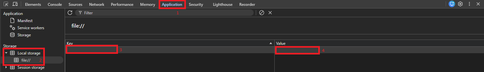

# dev-dashboard
Helpful dashboard for developers to find important pages easily.

## Importing dashboards
You can create your own dashboard with your own links, but if you need a starting point you can follow the instructions below to import existing setups.

Open Dev Console with F12, go to Application (1) and find the local storage for the Dev Dashboard (2). If you don't have anything yet, the key-value will be empty. If you have stuff there already, look for the devDashboardBookmarks key. If you have it, edit the value by double-clicking the Value (4), delete everything (Ctrl-A + Del) and then paste the recommended bookmarks JSON there (Ctrl-V) and hit Enter. If you don't have it, double click the first empty row (3) and paste the devDashboardBookmarks key, and then paste the JSON into the value as described above.